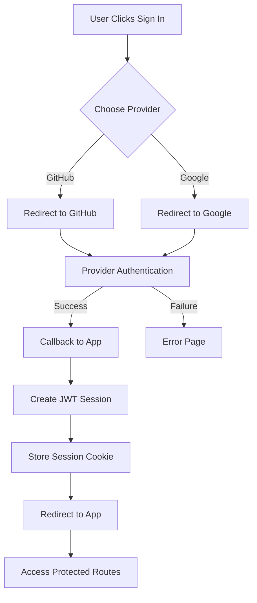

# Cloud Summit 2025 Authentication System

## How Does It Work?
In our system, instead of managing usernames and passwords, we use OAuth - a secure way to let users sign in through accounts they already have (like GitHub or Google). This is both more secure and more convenient for users.

### The Sign In Journey
When a user wants to access our voting system:

1. They click "Sign In" and choose either GitHub or Google
2. They're taken to GitHub/Google's login page (if not already signed in)
3. GitHub/Google asks if they want to share their information with our app
4. After approving, they're sent back to our app
5. The user is now signed in

### Keeping Users Signed In
We use sessions to remember who users are:
- A secure token (JWT) is created
- This token is stored safely in their browser as a cookie
- If you refresh the page it automatically signs in

## Security Features

### Protecting User Data
This social login approach is actually a very nice approach to security because:
- We only store the user's email
- We don't keep passwords, we leverage third party authentification
- We use special secure cookies that can't be accessed by scripts
- Although as always we should further enhance security, specially towards our own website security.

### Protected Areas
- Voting pages: Where users cast their votes
- Vote API: Where vote data is processed
- Auth API: Where login information is handled

## Technical Architecture

### File Structure
```
src/
├── app/
│   ├── api/
│   │   └── auth/
│   │       └── [...nextauth]/
│   │           └── route.ts    # NextAuth API routes
│   ├── auth/
│   │   └── signin/
│   │       └── page.tsx        # Custom sign-in page
│   └── layout.tsx              # Root layout with auth provider
├── lib/
│   ├── auth.ts                 # Auth configuration and utilities
│   └── session.ts              # Session management helpers
└── middleware.ts               # Route protection middleware
```

### Key Components

1. **Auth Configuration** (`src/lib/auth.ts`)
   - OAuth provider setup
   - Session callbacks
   - JWT configuration
   - User profile handling

2. **Middleware** (`src/middleware.ts`)
   - Route protection logic
   - Session validation
   - Authentication redirects

3. **API Routes** (`src/app/api/auth/[...nextauth]/route.ts`)
   - Authentication endpoints
   - Session management
   - Callback handling

4. **Client Components**
   - Auth Provider wrapper
   - Sign-in/out buttons
   - Protected route components

### Authentication Flow Details

1. **Initial Setup**
   ```typescript
   // Environment variables required
   NEXTAUTH_URL=http://localhost:3000
   NEXTAUTH_SECRET=your-secret-key
   GITHUB_ID=your-github-oauth-id
   GITHUB_SECRET=your-github-oauth-secret
   ```

2. **Session Management**
   - JWT-based sessions
   - Server-side validation
   - Automatic token rotation
   - Secure cookie handling

3. **Route Protection**
   - Middleware-based protection
   - Role-based access control
   - API route guards
   - Client-side redirects

### Integration Points

1. **Database Integration**
   - User session storage
   - OAuth account linking
   - Token management

2. **Frontend Integration**
   - Auth context provider
   - Protected route components
   - Loading states
   - Error boundaries

3. **API Security**
   - CSRF protection
   - Rate limiting
   - Request validation
   - Error handling

### Development Setup

1. **Local Development**
   - OAuth provider configuration
   - Environment variable setup
   - SSL for secure cookies
   - Testing utilities

2. **Testing Considerations**
   - Mock authentication
   - Session testing
   - Protected route testing
   - Error scenario testing

### Error Handling

1. **Common Scenarios**
   - Invalid credentials
   - Expired sessions
   - Network failures
   - Provider outages

2. **Recovery Strategies**
   - Automatic retry
   - Graceful degradation
   - User feedback
   - Session recovery

### Performance Considerations

1. **Optimization**
   - Session caching
   - Token validation
   - Request throttling 
   - Resource management

2. **Monitoring**
   - Auth failures
   - Session metrics
   - Response times
   - Error rates

## Process Flows

### Authentication Flow Diagram


### Session Validation Flow


