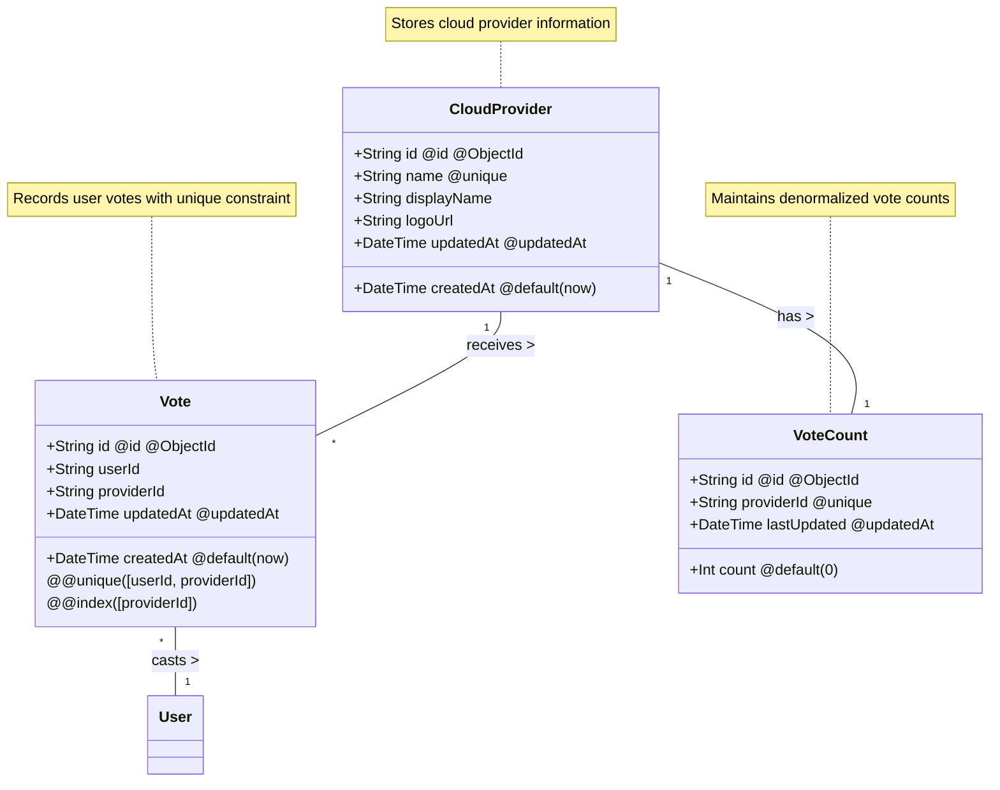

# Cloud Summit 2025 Voting System

## Overview

A secure voting platform that enables authenticated users to vote for their preferred cloud provider. The system uses MongoDB for data storage and provides REST APIs in Next.js server components for vote management.

## API Routes and Caching Strategy

### Static vs Dynamic Routes

Our API implements a hybrid caching strategy to balance performance and real-time data needs:

#### Static with Revalidation
- `/api/providers`: Cached and revalidated hourly
  - Cloud providers rarely change
  - No user-specific data
  - Benefits from caching for better performance
  - Uses `revalidate = 3600` (1 hour)

#### Dynamic Routes
- `/api/vote`: Must be dynamic because:
  - Processes real-time voting actions
  - Requires fresh vote counts
  - Handles user-specific authentication
  - Modifies database state
  
- `/api/vote/current`: Must be dynamic because:
  - Returns user-specific vote data
  - Requires fresh authentication checks
  - Needs to reflect recent vote changes
  - Cannot be cached across users

- `/api/admin/config/vote-limit`: Must be dynamic because:
  - Manages vote limit configuration
  - Requires admin authentication
  - Modifies system settings

This strategy ensures:
- Fast response times for stable data
- Real-time accuracy for voting operations
- Proper security for user actions
- Optimal database usage

### Activity Diagram of the Voting Process with Authentication


## Database Structure

### Database UML Diagram


### Models

#### CloudProvider
Stores information about available cloud providers.

```prisma
model CloudProvider {
  id          String   @id @default(auto()) @map("_id") @db.ObjectId  // MongoDB unique identifier
  name        String   @unique    // Internal reference name (e.g., 'aws', 'gcp')
  displayName String              // User-friendly name shown in UI
  logoUrl     String              // Provider's logo URL for display
  createdAt   DateTime @default(now())  // Record creation timestamp
  updatedAt   DateTime @updatedAt       // Last modification timestamp
}
```

Key features:
- `@unique` on `name` prevents duplicate providers
- `displayName` can be updated without affecting relationships
- `logoUrl` stored as URL instead of local file for scalability
- Timestamps for auditing and caching

#### Vote
Records individual user votes with a unique constraint to prevent duplicates.

```prisma
model Vote {
  id          String   @id @default(auto()) @map("_id") @db.ObjectId  // MongoDB unique identifier
  userId      String   // OAuth user email (e.g., 'user@example.com')
  providerId  String   // Reference to CloudProvider.id
  createdAt   DateTime @default(now())  // When vote was cast
  updatedAt   DateTime @updatedAt       // When vote was last changed

  @@unique([userId, providerId])  // Ensures one vote per user-provider combination
  @@index([providerId])          // Optimizes vote counting and provider lookups
}
```

Key features:
- Composite unique constraint prevents duplicate votes
- Indexed `providerId` for efficient queries
- `userId` uses OAuth email for consistent identification
- Timestamps track voting history

#### VoteCount
Maintains a denormalized count of votes per provider for performance.

```prisma
model VoteCount {
  id          String   @id @default(auto()) @map("_id") @db.ObjectId  // MongoDB unique identifier
  providerId  String   @unique    // Reference to CloudProvider.id
  count       Int      @default(0)  // Current number of votes
  lastUpdated DateTime @updatedAt    // Last count update timestamp
}
```

Key features:
- Separate from Vote model for query performance
- `@unique` on `providerId` ensures one count per provider
- Default count of 0 for new providers
- `lastUpdated` helps with caching and sync verification

### Model Relationships

1. **CloudProvider → VoteCount**
   - One-to-one relationship
   - Connected via `providerId`
   - Each provider has exactly one vote count

2. **CloudProvider → Vote**
   - One-to-many relationship
   - Provider can have multiple votes
   - Each vote belongs to one provider

3. **User → Vote**
   - One-to-many relationship
   - User can have multiple votes (one per provider)
   - Each vote belongs to one user

### Database Indexes
- `CloudProvider.name`: Unique index for lookups
- `Vote.providerId`: Index for vote counting
- `Vote.[userId, providerId]`: Unique composite index
- `VoteCount.providerId`: Unique index for updates

## Voting Process

### Authentication & Loading
1. Verify user authentication
2. Load providers and vote counts
3. Check user's existing vote

### Vote Submission
1. **UI Update**
   - Show selected provider
   - Update vote count
   - Change button state

2. **Server Processing**
   - Save vote in database
   - Update vote counts

### Optimistic Updates
Updates UI before server confirmation:
1. User votes → UI updates immediately
2. Server processes vote in background
3. Success → Continue
4. Failure → Revert UI, show error

## API Endpoints

### Get Current Vote
```
GET /api/vote/current
```
Returns user's current vote status and vote limit information.

Response (200):
```json
{
  "vote": {
    "id": "507f1f77bcf86cd799439011",
    "providerId": "507f1f77bcf86cd799439012",
    "userId": "user@example.com"
  },
  "voteLimitEnabled": true,
  "dailyVotesRemaining": 2,
  "dailyVoteCount": 1
}
```

### Submit Vote
```
POST /api/vote
```
Records or updates a vote.

Request:
```json
{
  "providerId": "507f1f77bcf86cd799439012"
}
```

Response (200):
```json
{
  "success": true,
  "vote": {
    "id": "507f1f77bcf86cd799439011",
    "providerId": "507f1f77bcf86cd799439012",
    "userId": "user@example.com"
  },
  "changed": true,
  "dailyVotesRemaining": 2,
  "dailyVoteCount": 1,
  "voteLimitEnabled": true,
  "message": "Vote updated successfully. You have 2 vote changes remaining today."
}
```

### Get Vote Counts
```
GET /api/vote
```
Returns current vote tallies.

Response (200):
```json
[
  {
    "providerId": "507f1f77bcf86cd799439012",
    "count": 42,
    "lastUpdated": "2024-03-21T12:00:00Z"
  }
]
```

### Get Providers
```
GET /api/providers
```
Returns available cloud providers.

Response (200):
```json
[
  {
    "id": "507f1f77bcf86cd799439012",
    "name": "aws",
    "displayName": "Amazon Web Services",
    "logoUrl": "/cloud-providers/aws.svg"
  }
]
```

### Vote Limit Configuration (Admin Only)
```
GET /api/admin/config/vote-limit
```
Returns current vote limit configuration.

Response (200):
```json
{
  "enabled": true,
  "value": "3"
}
```

```
POST /api/admin/config/vote-limit
```
Updates vote limit configuration.

Request:
```json
{
  "enabled": true,
  "value": "3"
}
```

Response (200):
```json
{
  "success": true,
  "config": {
    "key": "DAILY_VOTE_LIMIT",
    "value": "3",
    "description": "Maximum number of vote changes allowed per user per day",
    "updatedBy": "admin@example.com"
  },
  "message": "Vote limit configuration updated"
}
```

## Error Handling

### API Errors
All endpoints return consistent error format:
```json
{
  "error": "Error description",
  "message": "User-friendly error message",
  "details": "Optional error details"
}
```

Common status codes:
- 200: Success
- 400: Invalid request
- 401: Authentication required
- 429: Vote limit reached
- 500: Server error

### Vote Limit Errors
When vote limit is reached:
```json
{
  "error": "Daily vote limit reached",
  "message": "You can only change your vote 3 times per day. Please try again tomorrow.",
  "dailyVotesRemaining": 0,
  "voteLimitEnabled": true
}
```
